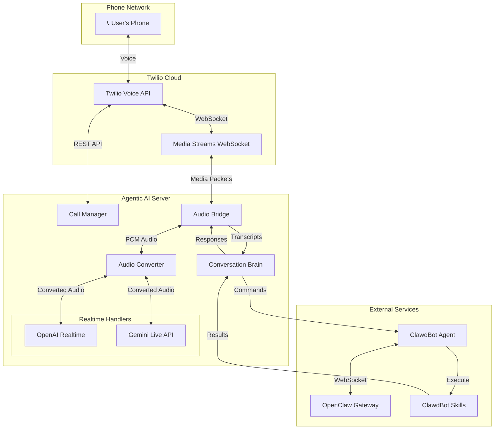
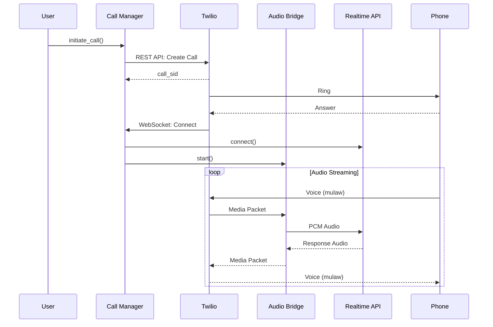
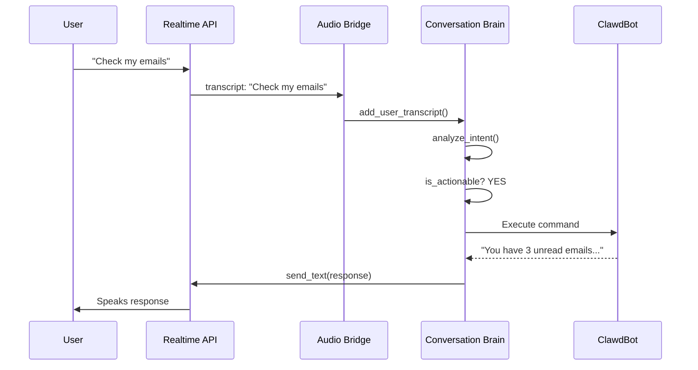

## Overview

Agentic AI is a real-time voice agent system that combines **OpenAI Realtime API** (or Gemini Live), **Twilio** for telephony, and **ClawdBot** for command execution. The architecture is designed for low-latency bidirectional audio streaming with intelligent intent understanding.

## Architecture Diagram



## Core Components

### Call Manager

The **CallManager** (`call_manager.py:41`) orchestrates the entire call lifecycle:

- Initiates outbound calls via Twilio REST API
- Handles incoming call registration
- Manages active call sessions and state
- Coordinates between Twilio, audio processing, and AI handlers
- Tracks call metadata and duration

<Info>
The CallManager maintains a registry of active sessions and pending calls, allowing it to route media streams to the correct audio bridge when Twilio connects.
</Info>

**Key Methods:**
- `initiate_call()` - Start an outbound call (call_manager.py:126)
- `register_incoming_call()` - Handle incoming calls (call_manager.py:189)
- `handle_media_stream()` - Route WebSocket to audio bridge (call_manager.py:284)

### Audio Bridge

The **AudioBridge** (`audio_bridge.py:32`) is the heart of real-time audio processing:

```python
# Bidirectional audio flow
Twilio (mulaw 8kHz) <--> AudioConverter <--> Realtime API (PCM 16/24kHz)
```

**Responsibilities:**
- Receives audio from Twilio WebSocket
- Converts audio formats using AudioConverter
- Routes audio to/from OpenAI or Gemini handlers
- Manages transcript collection
- Feeds transcripts to ConversationBrain for analysis

<Note>
The AudioBridge buffers small audio chunks (~50ms) before sending to improve STT accuracy and reduce API calls.
</Note>

### Conversation Brain

The **ConversationBrain** (`conversation_brain.py:76`) provides intelligence:

- Analyzes user intent from transcripts
- Distinguishes actionable commands from casual conversation
- Routes commands to ClawdBot for execution
- Maintains conversation memory and context
- Feeds ClawdBot responses back to the AI to speak

See [Conversation Brain](/concepts/conversation-brain) for detailed documentation.

### Audio Converter

The **AudioConverter** (`audio/converter.py:25`) handles all audio format transformations:

**Format Support:**
- Twilio: mulaw 8kHz mono
- Gemini Input: PCM 16-bit 16kHz mono
- Gemini Output: PCM 16-bit 24kHz mono
- OpenAI: PCM 16-bit 24kHz mono (both directions)

**Key Features:**
- High-quality resampling using `soxr`
- Efficient mulaw ↔ PCM conversion
- Reusable resampler instances for performance

See [Audio Pipeline](/concepts/audio-pipeline) for detailed documentation.

## Data Flow

### Outbound Call Flow



### Intent Processing Flow



## Configuration

The system uses a centralized `config.yaml` loaded by `Config` class (`core/config.py`):

```yaml
openai_realtime:
  enabled: true
  api_key: ${OPENAI_API_KEY}
  model: "gpt-4o-realtime-preview-2024-12-17"
  voice: "alloy"

gemini:
  api_key: ${GEMINI_API_KEY}
  model: "models/gemini-2.5-flash-native-audio-preview-12-2025"
  voice: "Puck"

twilio:
  account_sid: ${TWILIO_ACCOUNT_SID}
  auth_token: ${TWILIO_AUTH_TOKEN}
  from_number: ${TWILIO_PHONE_NUMBER}

gateway:
  url: "ws://127.0.0.1:18789"
```

<Tip>
Environment variables are expanded using `${VAR_NAME}` syntax, keeping secrets out of the config file.
</Tip>

## Session Management

Each call is tracked as a **CallSession** (`call_manager.py:28`):

```python
@dataclass
class CallSession:
    call_id: str          # UUID for this call
    call_sid: str         # Twilio call identifier
    to_number: str        # Phone number
    prompt: str           # System instruction for AI
    metadata: dict        # Custom metadata
    start_time: datetime  # When call started
    bridge: AudioBridge   # Active audio bridge
    status: str           # Current status
```

**Status Lifecycle:**
1. `initiating` - Call being created
2. `ringing` - Phone is ringing
3. `in-progress` - Active conversation
4. `completed` / `failed` - Call ended

## WebSocket Protocols

### Twilio Media Streams

Twilio sends/receives media via WebSocket messages:

```json
{
  "event": "media",
  "media": {
    "payload": "<base64-encoded-mulaw>",
    "timestamp": "1234567890"
  }
}
```

Handled by `TwilioMediaStreamHandler` (`twilio/websocket.py`).

### OpenClaw Gateway

Communication with ClawdBot uses JSON-RPC 2.0:

```json
{
  "jsonrpc": "2.0",
  "id": 1,
  "method": "sessions_send",
  "params": {
    "message": {
      "type": "call_started",
      "call_id": "abc-123",
      "prompt": "..."
    }
  }
}
```

Handled by `GatewayClient` (`gateway/client.py:16`).

See [ClawdBot Integration](/concepts/clawdbot-integration) for details.

## Scalability Considerations

<Note>
The current architecture is designed for **single-instance deployments** handling concurrent calls on one server.
</Note>

**Resource Usage Per Call:**
- 1 WebSocket to Twilio
- 1 WebSocket to Realtime API (OpenAI/Gemini)
- Audio processing: ~2-5% CPU per call
- Memory: ~50-100 MB per active call

**Scaling Options:**
1. Vertical: Increase server resources for more concurrent calls
2. Horizontal: Deploy multiple instances with load balancing (requires session affinity)
3. Queue-based: Use message queue for intent processing to reduce realtime load

## Error Handling

The system implements graceful degradation:

- **WebSocket disconnections**: Automatic reconnection with exponential backoff
- **API failures**: Fallback to error messages spoken to user
- **Intent analysis errors**: Default to treating as actionable (safer)
- **ClawdBot timeout**: User notified of delay, continues conversation

```python
# Example from conversation_brain.py:385
except Exception as e:
    logger.error("Error analyzing intent", error=str(e))
    # Default to actionable to avoid missing commands
    return "action", {"original_request": user_text}, True
```

## Next Steps

<CardGroup cols={2}>
  <Card title="Conversation Brain" icon="brain" href="/concepts/conversation-brain">
    Deep dive into intent understanding and command routing
  </Card>
  
  <Card title="Audio Pipeline" icon="waveform" href="/concepts/audio-pipeline">
    Learn about audio format conversion and processing
  </Card>
  
  <Card title="ClawdBot Integration" icon="robot" href="/concepts/clawdbot-integration">
    How commands are executed via OpenClaw Gateway
  </Card>
  
  <Card title="Getting Started" icon="rocket" href="/quickstart">
    Set up your own Agentic AI instance
  </Card>
</CardGroup>