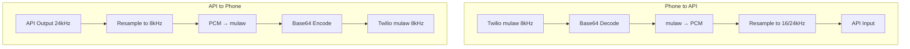
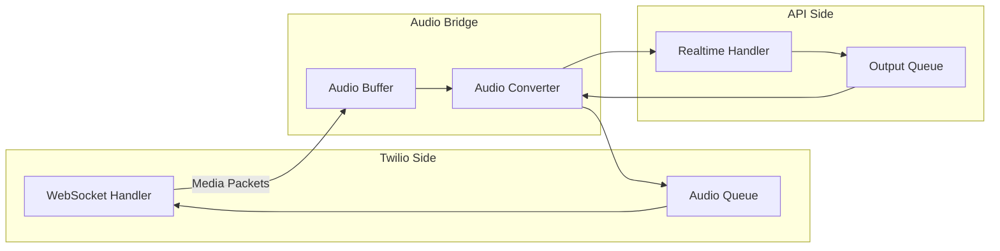
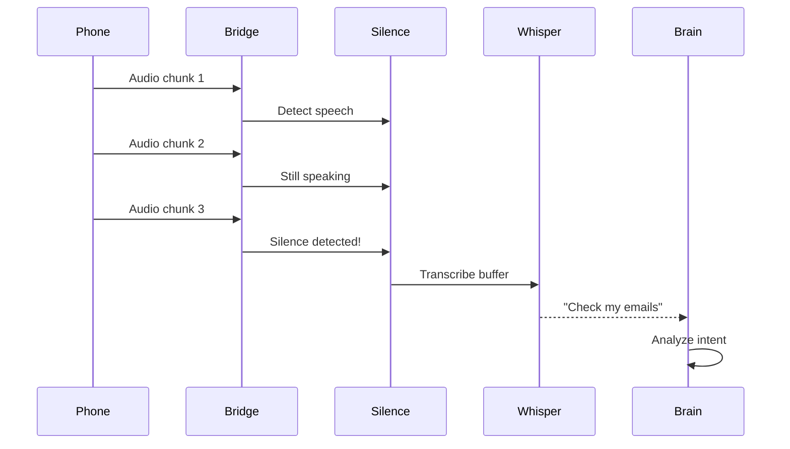

## Overview

The audio pipeline handles bidirectional audio streaming between Twilio's telephony network and OpenAI/Gemini's Realtime APIs. It manages format conversion, buffering, and low-latency processing to enable natural voice conversations.

<Info>
Key Components:
- **AudioConverter**: Format conversion (`audio/converter.py:25`)
- **AudioBridge**: Bidirectional routing (`core/audio_bridge.py:32`)
- **TwilioMediaStreamHandler**: WebSocket handling (`twilio/websocket.py`)
</Info>

## Audio Format Requirements

### Twilio Media Streams

**Specification:**
- Codec: **μ-law (mulaw)**
- Sample Rate: **8 kHz**
- Channels: **Mono**
- Encoding: **Base64** over WebSocket
- Packet Size: **20ms of audio** (160 bytes encoded)

```json
{
  "event": "media",
  "media": {
    "payload": "<base64-mulaw-audio>",
    "timestamp": "1234567890"
  }
}
```

### Gemini Live API

**Input Specification:**
- Codec: **PCM 16-bit**
- Sample Rate: **16 kHz**
- Channels: **Mono**
- Format: **Raw PCM bytes**

**Output Specification:**
- Codec: **PCM 16-bit**
- Sample Rate: **24 kHz**
- Channels: **Mono**
- Format: **Raw PCM bytes**

### OpenAI Realtime API

**Specification (both input and output):**
- Codec: **PCM 16-bit**
- Sample Rate: **24 kHz**
- Channels: **Mono**
- Format: **Base64-encoded PCM**

<Note>
OpenAI uses the same 24kHz sample rate for both input and output, simplifying the pipeline compared to Gemini's asymmetric rates.
</Note>

## Audio Converter

The **AudioConverter** class (`audio/converter.py:25`) handles all format transformations.

### Conversion Pipeline



### Implementation Details

#### Twilio → Gemini

```python
# audio/converter.py:44
def twilio_to_gemini(self, twilio_payload: str) -> bytes:
    # 1. Decode base64
    mulaw_bytes = base64.b64decode(twilio_payload)
    
    # 2. Convert mulaw to PCM 16-bit
    pcm_8khz = audioop.ulaw2lin(mulaw_bytes, 2)
    
    # 3. Resample 8kHz -> 16kHz
    pcm_16khz = self._resample(pcm_8khz, 8000, 16000)
    
    return pcm_16khz
```

**Libraries Used:**
- `audioop`: Fast μ-law ↔ PCM conversion (built-in)
- `soxr`: High-quality resampling (professional audio quality)

#### Gemini → Twilio

```python
# audio/converter.py:69
def gemini_to_twilio(self, gemini_audio: bytes) -> str:
    # 1. Resample 24kHz -> 8kHz
    pcm_8khz = self._resample(gemini_audio, 24000, 8000)
    
    # 2. Convert PCM to mulaw
    mulaw_bytes = audioop.lin2ulaw(pcm_8khz, 2)
    
    # 3. Base64 encode
    return base64.b64encode(mulaw_bytes).decode("ascii")
```

#### OpenAI Conversions

```python
# audio/converter.py:92
def twilio_to_openai(self, twilio_payload: str) -> bytes:
    # Similar to Gemini, but resample to 24kHz
    mulaw_bytes = base64.b64decode(twilio_payload)
    pcm_8khz = audioop.ulaw2lin(mulaw_bytes, 2)
    pcm_24khz = self._resample(pcm_8khz, 8000, 24000)
    return pcm_24khz

def openai_to_twilio(self, openai_audio: bytes) -> str:
    # Same as gemini_to_twilio (both use 24kHz output)
    return self.gemini_to_twilio(openai_audio)
```

### Resampling Quality

Using **soxr** (SoX Resampler) for high-quality audio resampling:

```python
# audio/converter.py:134
def _resample(self, audio_bytes: bytes, from_rate: int, to_rate: int) -> bytes:
    # Convert to numpy array
    audio_array = np.frombuffer(audio_bytes, dtype=np.int16)
    
    # High-quality resampling
    resampled = soxr.resample(audio_array, from_rate, to_rate, quality="HQ")
    
    # Convert back to bytes
    return resampled.astype(np.int16).tobytes()
```

<Tip>
**Quality Setting**: `"HQ"` (High Quality) provides excellent audio fidelity while maintaining low latency (~10-20ms processing time).
</Tip>

## Audio Bridge

The **AudioBridge** (`audio_bridge.py:32`) orchestrates bidirectional audio flow.

### Bridge Architecture



### Buffering Strategy

The bridge buffers small audio chunks before sending to improve efficiency:

```python
# audio_bridge.py:74
self._audio_buffer = bytearray()
self._min_chunk_size = 2400 if use_openai else 1600  # ~50ms

async def _handle_twilio_audio(self, payload: str):
    pcm_audio = self._converter.twilio_to_openai(payload)
    
    # Buffer until minimum size reached
    self._audio_buffer.extend(pcm_audio)
    
    if len(self._audio_buffer) >= self._min_chunk_size:
        await self.gemini.send_audio(bytes(self._audio_buffer))
        self._audio_buffer.clear()
```

**Why Buffer?**
- **Reduces API calls**: Fewer WebSocket messages
- **Improves STT accuracy**: Larger chunks provide more context
- **Lower latency**: 50ms buffer vs Twilio's 20ms packets

<Note>
Previous versions used 100ms buffers, but this was reduced to 50ms for better responsiveness. Testing showed minimal STT quality impact.
</Note>

### Bidirectional Processing

Two concurrent tasks handle audio flow:

```python
# audio_bridge.py:149
async def start(self):
    self._tasks = [
        asyncio.create_task(self.twilio.receive_loop()),     # Incoming audio
        asyncio.create_task(self._process_gemini_audio()),   # Outgoing audio
    ]
```

#### Incoming Audio (Phone → API)

```python
async def _handle_twilio_audio(self, payload: str):
    # Convert format
    pcm_audio = self._converter.twilio_to_gemini(payload)
    
    # Buffer and send
    self._audio_buffer.extend(pcm_audio)
    if len(self._audio_buffer) >= self._min_chunk_size:
        await self.gemini.send_audio(bytes(self._audio_buffer))
        self._audio_buffer.clear()
```

#### Outgoing Audio (API → Phone)

```python
# audio_bridge.py:225
async def _process_gemini_audio(self):
    while self._is_running:
        # Get audio from API
        audio_bytes = await self.gemini.get_audio()
        
        # Convert to Twilio format
        twilio_payload = self._converter.gemini_to_twilio(audio_bytes)
        
        # Send to phone
        await self.twilio.send_audio(twilio_payload)
```

## Whisper STT Integration

Optional high-accuracy transcription using OpenAI Whisper (`audio/whisper_stt.py`).

### Whisper Pipeline



### Silence Detection

```python
# audio/whisper_stt.py (SilenceDetector)
class SilenceDetector:
    def __init__(
        self,
        silence_threshold: int = 500,      # RMS threshold
        silence_duration_ms: int = 500,    # 500ms silence
        sample_rate: int = 16000,
    ):
        # ...
    
    def process(self, audio_chunk: bytes) -> bool:
        """Returns True if silence detected after speech."""
        rms = self._calculate_rms(audio_chunk)
        
        if rms > self.silence_threshold:
            self._is_speech = True
            self._silence_start = None
        elif self._is_speech:
            # Started silence after speech
            if not self._silence_start:
                self._silence_start = datetime.now()
            else:
                duration = (datetime.now() - self._silence_start).total_seconds()
                if duration >= self._silence_duration:
                    return True  # End of speech!
        
        return False
```

### Whisper Transcription

```python
# audio_bridge.py:344
async def _transcribe_whisper_buffer(self):
    # Minimum 300ms of audio required
    min_audio_bytes = int(0.3 * 16000 * 2)
    if len(self._whisper_audio_buffer) < min_audio_bytes:
        self._whisper_audio_buffer.clear()
        return
    
    # Transcribe with proper noun hints
    transcript = await self._whisper.transcribe(
        audio_bytes=audio_to_transcribe,
        sample_rate=16000,
        prompt="YouTube, Spotify, WhatsApp, Telegram, ...",
    )
```

<Tip>
**Prompt Engineering**: The `prompt` parameter helps Whisper correctly recognize proper nouns and brand names common in voice commands.
</Tip>

## Performance Optimization

### Latency Breakdown

**End-to-end latency** (user speaks → AI responds):

```
User speech          →  0ms
Twilio encoding      →  +20ms (packet buffering)
Network to server    →  +30-100ms
Format conversion    →  +5-10ms
API processing       →  +200-500ms (STT + LLM)
API audio generation →  +100-300ms (streaming TTS)
Format conversion    →  +5-10ms
Network to Twilio    →  +30-100ms
Twilio decoding      →  +20ms
───────────────────────────────
Total:                  410-1060ms
```

<Info>
**Target**: Keep processing overhead under 50ms (conversion + buffering) to maintain sub-1-second responses.
</Info>

### Optimization Techniques

#### 1. Resampler Reuse

```python
# audio/converter.py:29
def __init__(self):
    self._resamplers: dict = {}  # Cache resampler instances

def _get_resampler(self, from_rate, to_rate, quality="HQ"):
    key = (from_rate, to_rate, quality)
    if key not in self._resamplers:
        self._resamplers[key] = soxr.ResampleStream(...)
    return self._resamplers[key]
```

**Benefit**: Avoids resampler initialization overhead (~5-10ms per instance).

#### 2. Minimal Buffering

```python
# Reduced from 100ms to 50ms
self._min_chunk_size = 2400  # 50ms at 24kHz
```

**Trade-off**: Smaller buffers = faster responses, but more API calls and slightly lower STT accuracy.

#### 3. Async Processing

```python
# All audio operations are async to avoid blocking
await self.gemini.send_audio(audio)
await self.twilio.send_audio(payload)
```

**Benefit**: Server can handle multiple concurrent calls without blocking.

## Audio Quality Metrics

### Measuring Quality

```python
# audio/converter.py:192
@staticmethod
def calculate_duration_ms(audio_bytes: bytes, sample_rate: int) -> float:
    num_samples = len(audio_bytes) // 2  # 16-bit = 2 bytes per sample
    return (num_samples / sample_rate) * 1000
```

**Key Metrics:**
- **Sample Rate Accuracy**: Verify resampled audio has correct sample count
- **Amplitude Preservation**: RMS levels should match across conversions
- **No Clipping**: Peak values stay within int16 range (-32768 to 32767)

### Testing Audio Quality

Use `audioop.rms()` to verify amplitude preservation:

```python
import audioop

original_rms = audioop.rms(original_audio, 2)
converted_rms = audioop.rms(converted_audio, 2)

# Should be within 10% for good quality
ratio = converted_rms / original_rms
assert 0.9 <= ratio <= 1.1, "Significant amplitude change!"
```

## Common Issues & Solutions

### Issue: Choppy Audio

**Symptoms**: Robotic voice, stuttering, gaps

**Causes:**
- Buffer underrun (not sending audio fast enough)
- Network congestion
- API rate limiting

**Solutions:**
```python
# Increase buffer size slightly
self._min_chunk_size = 3200  # 66ms at 24kHz

# Add queue for outgoing audio
self._outgoing_queue = asyncio.Queue(maxsize=50)
```

### Issue: High Latency

**Symptoms**: Long delay before AI responds

**Causes:**
- Large audio buffers
- Slow resampling
- Network latency

**Solutions:**
```python
# Reduce buffer size
self._min_chunk_size = 1600  # 33ms at 24kHz

# Use faster resampling quality
resampled = soxr.resample(..., quality="MQ")  # Medium Quality
```

### Issue: Poor Transcription

**Symptoms**: Misheard words, especially proper nouns

**Causes:**
- Too small audio chunks
- No Whisper hints
- Poor audio quality

**Solutions:**
```python
# Enable Whisper STT with prompts
whisper_enabled: true

# Add domain-specific hints
prompt = "YouTube, Spotify, common names and brands"
```

## Debug & Monitoring

### Audio Flow Logging

```python
# audio_bridge.py includes extensive logging
print(f"=== AUDIO BRIDGE: First Gemini audio received! {len(audio_bytes)} bytes ===")
print(f"=== AUDIO BRIDGE: Processed {chunk_count} audio chunks ===")
```

### Performance Monitoring

```python
import time

start = time.perf_counter()
audio_converted = converter.twilio_to_gemini(payload)
elapsed_ms = (time.perf_counter() - start) * 1000

if elapsed_ms > 10:
    logger.warning(f"Slow conversion: {elapsed_ms:.1f}ms")
```

## Configuration

### Audio Settings

```yaml
# config.yaml
whisper:
  enabled: true              # Use Whisper for accurate STT
  api_key: ${OPENAI_API_KEY}

openai_realtime:
  enabled: true              # Use OpenAI (24kHz) vs Gemini (16/24kHz)
  model: "gpt-4o-realtime-preview-2024-12-17"

gemini:
  model: "models/gemini-2.5-flash-native-audio-preview-12-2025"
  voice: "Puck"              # Voice selection
```

### Runtime Configuration

```python
# audio_bridge.py:39
AudioBridge(
    twilio_handler=twilio_handler,
    gemini_handler=realtime_handler,
    whisper_api_key=whisper_key,
    whisper_enabled=True,
    use_openai=True,  # Changes audio format handling
)
```

## Related Components

<CardGroup cols={2}>
  <Card title="Architecture" icon="sitemap" href="/concepts/architecture">
    See how audio fits into the overall system
  </Card>
  
  <Card title="Conversation Brain" icon="brain" href="/concepts/conversation-brain">
    Learn how transcripts are processed for intent
  </Card>
  
  <Card title="ClawdBot Integration" icon="robot" href="/concepts/clawdbot-integration">
    Understand how commands are executed
  </Card>
</CardGroup>