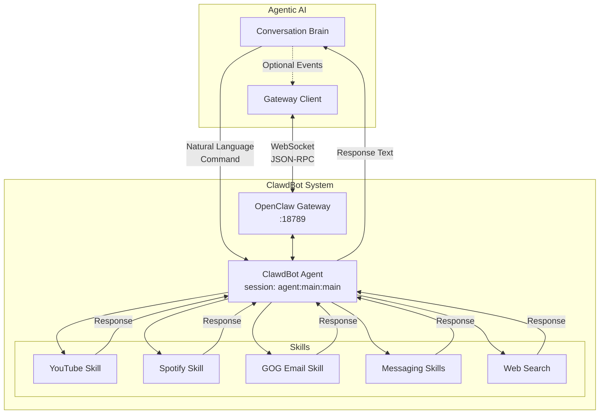
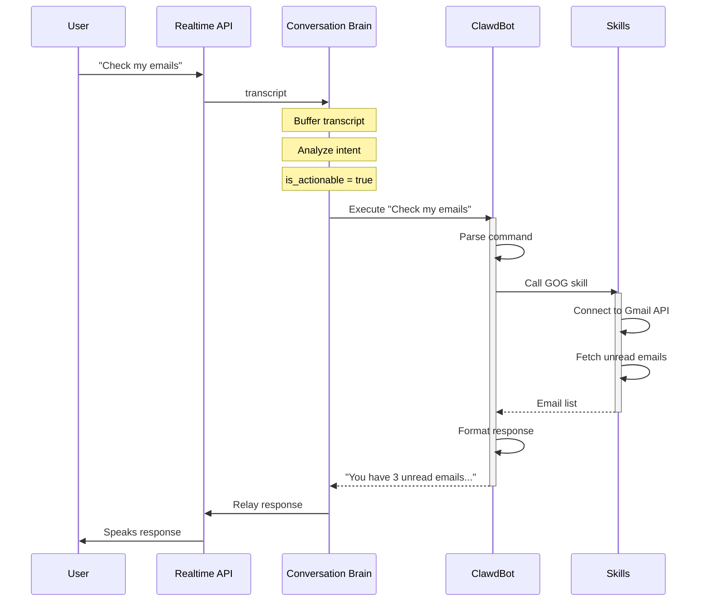

## Overview

Agentic AI integrates with **ClawdBot** to execute real-world commands like sending messages, checking emails, playing music, and more. The integration uses the **OpenClaw Gateway** WebSocket protocol to communicate with ClawdBot's agent system.

<Info>
ClawdBot is a separate project that provides an LLM-powered agent with skills for interacting with external services. Learn more at [ClawdBot GitHub](https://github.com/AceDZN/clawdbot).
</Info>

## Integration Architecture



## Communication Methods

Agentic AI supports **two methods** for communicating with ClawdBot:

### Method 1: Direct CLI Execution (Current)

The ConversationBrain executes ClawdBot commands directly via subprocess:

```python
# conversation_brain.py:140
cmd = [
    "clawdbot", "agent",
    "--session-id", "agent:main:main",
    "--message", processed_command,
    "--timeout", "90",
]

process = await asyncio.create_subprocess_exec(
    *cmd,
    stdout=asyncio.subprocess.PIPE,
    stderr=asyncio.subprocess.PIPE,
    env={**os.environ, 'GOG_ACCOUNT': 'user@example.com'},
)

stdout, stderr = await asyncio.wait_for(
    process.communicate(),
    timeout=95
)

response_text = stdout.decode('utf-8').strip()
```

**Advantages:**
- Simple, direct communication
- No additional infrastructure needed
- Immediate response capture
- Works with existing ClawdBot CLI

**Disadvantages:**
- Higher overhead per command (new process)
- No persistent agent session
- Limited to local ClawdBot installation

### Method 2: WebSocket Gateway (Optional)

Communicate via the OpenClaw Gateway WebSocket protocol:

```python
# gateway/client.py:16
class GatewayClient:
    async def connect(self) -> None:
        self._ws = await websockets.connect(
            "ws://127.0.0.1:18789",
            ping_interval=30,
            ping_timeout=10,
        )
        
    async def send_message(self, message: GatewayMessage) -> None:
        rpc_message = {
            "jsonrpc": "2.0",
            "id": self._message_id,
            "method": "sessions_send",
            "params": {
                "message": message.to_dict(),
            },
        }
        await self._ws.send(json.dumps(rpc_message))
```

**Advantages:**
- Persistent connection (lower latency)
- Supports remote ClawdBot instances
- Event-driven architecture
- Automatic reconnection with backoff

**Disadvantages:**
- Requires OpenClaw Gateway running
- More complex setup
- Asynchronous response handling

<Note>
The current implementation uses **Method 1 (Direct CLI)** for simplicity. The Gateway client code exists but is disabled by default in `call_manager.py:89-99`.
</Note>

## ClawdBot Session Management

### Session Identifier

Commands are sent to a specific ClawdBot agent session:

```bash
clawdbot agent --session-id agent:main:main
```

**Session ID Format**: `agent:main:main`
- First part: `agent` (agent type)
- Second part: `main` (primary session)
- Third part: `main` (sub-session)

<Tip>
The session ID ensures commands go to the correct ClawdBot instance, especially important if running multiple agents.
</Tip>

### Starting ClawdBot Agent

Before using Agentic AI, start the ClawdBot agent:

```bash
# Start the agent in the background
clawdbot agent --session-id agent:main:main &

# Or run in a separate terminal
clawdbot agent --session-id agent:main:main
```

The agent will:
1. Connect to OpenClaw Gateway (ws://127.0.0.1:18789)
2. Load configured skills
3. Wait for incoming commands

## Supported Commands

ClawdBot skills enable various command types:

### YouTube Commands

```python
User: "Open YouTube and search for Zayn Dusk Till Dawn"
  ↓
ClawdBot: Uses YouTube skill
  ↓
Response: "Opening YouTube and searching for Zayn Dusk Till Dawn"
```

### Spotify Commands

```python
User: "Play Shape of You on Spotify"
  ↓
ClawdBot: Uses Spotify skill
  ↓
Response: "Playing Shape of You on Spotify"
```

### Email Commands (GOG Skill)

```python
User: "Check my emails"
  ↓
ClawdBot: Uses GOG (Gmail) skill
  ↓
Response: "You have 3 unread emails: 1 from John about..."
```

<Note>
The GOG skill requires the `GOG_ACCOUNT` environment variable to be set to your Gmail address.
</Note>

### Messaging Commands

```python
User: "Send hi to John on WhatsApp"
  ↓
ClawdBot: Uses WhatsApp skill
  ↓
Response: "Message sent to John on WhatsApp"
```

### Web Search

```python
User: "Search for nearby restaurants"
  ↓
ClawdBot: Uses web search skill
  ↓
Response: "Here are the top restaurants near you..."
```

## Command Execution Flow



## Implementation Details

### Command Preprocessing

The brain processes commands before sending to ClawdBot:

```python
# conversation_brain.py:134
processed_command = command.replace('\\n', '\n')
```

This handles cases where users say "new line" and it gets transcribed as `\n` (for email composition, etc.).

### Environment Variables

Special environment variables are passed to ClawdBot:

```python
env = {
    **os.environ,
    'GOG_ACCOUNT': 'user@example.com',  # Gmail account for GOG skill
}
```

<Warning>
Make sure to configure skill-specific environment variables (like `GOG_ACCOUNT`) before using those features.
</Warning>

### Response Filtering

ClawdBot output is filtered to remove noise:

```python
# conversation_brain.py:169
lines = response_text.split('\n')
clean_lines = [
    line for line in lines
    if line.strip()
    and 'DeprecationWarning' not in line
    and not line.startswith('(node:')
    and not line.startswith('(Use `node')
]
response_text = '\n'.join(clean_lines).strip()
```

This ensures only the actual response is spoken to the user.

### Timeout Handling

```python
# conversation_brain.py:157
try:
    stdout, stderr = await asyncio.wait_for(
        process.communicate(),
        timeout=95  # 5 seconds more than ClawdBot's timeout
    )
except asyncio.TimeoutError:
    process.kill()
    return "I'm still working on that. It's taking longer than expected."
```

Commands timeout after 90 seconds to prevent hanging the call.

## Gateway Client Details

For advanced use cases using the WebSocket gateway:

### Connection Management

```python
# gateway/client.py:64
async def connect(self) -> None:
    self._should_run = True
    
    while self._reconnect_attempts < self.max_reconnect_attempts:
        try:
            self._ws = await websockets.connect(
                self.url,
                ping_interval=30,
                ping_timeout=10,
            )
            self._is_connected = True
            
            # Start heartbeat and receive loops
            await self._heartbeat_loop()
            await self._receive_loop()
            
        except ConnectionRefusedError:
            # Exponential backoff reconnection
            delay = min(
                self.reconnect_base_delay * (2 ** self._reconnect_attempts),
                self.reconnect_max_delay,
            )
            await asyncio.sleep(delay)
```

### Message Types

The gateway supports various message types (`gateway/messages.py`):

**CallStartedMessage:**
```python
{
    "type": "call_started",
    "call_id": "abc-123",
    "to_number": "+1234567890",
    "prompt": "System instruction...",
    "metadata": {}
}
```

**CallEndedMessage:**
```python
{
    "type": "call_ended",
    "call_id": "abc-123",
    "duration": 180.5,
    "outcome": "completed",
    "full_transcript": "..."
}
```

**HeartbeatMessage:**
```python
{
    "type": "heartbeat",
    "timestamp": 1234567890
}
```

### JSON-RPC Protocol

Messages are sent using JSON-RPC 2.0:

```python
# gateway/client.py:173
async def _send_rpc(self, message: GatewayMessage) -> None:
    rpc_message = {
        "jsonrpc": "2.0",
        "id": self._message_id,
        "method": "sessions_send",
        "params": {
            "message": message.to_dict(),
        },
    }
    await self._ws.send(json.dumps(rpc_message))
```

**Response Format:**
```json
{
  "jsonrpc": "2.0",
  "id": 1,
  "result": {
    "status": "delivered"
  }
}
```

## Configuration

### Gateway Settings

```yaml
# config.yaml
gateway:
  url: "ws://127.0.0.1:18789"
  reconnect_max_attempts: 10
  reconnect_base_delay: 1.0
  reconnect_max_delay: 60.0
```

### Telegram Integration

The brain requires Telegram chat ID for identifying the ClawdBot agent:

```yaml
# config.yaml
telegram:
  enabled: true
  bot_token: ${TELEGRAM_BOT_TOKEN}
  chat_id: ${TELEGRAM_CHAT_ID}
```

<Info>
The `telegram_chat_id` is used as the session identifier for routing commands to the correct ClawdBot agent instance.
</Info>

## Enabling Gateway Mode

To switch from CLI execution to Gateway mode:

**Step 1**: Uncomment gateway client initialization in `call_manager.py`:

```python
# call_manager.py:92 (currently commented)
self._gateway_client = GatewayClient(
    url=self.config.gateway.url,
    max_reconnect_attempts=self.config.gateway.reconnect_max_attempts,
    reconnect_base_delay=self.config.gateway.reconnect_base_delay,
    reconnect_max_delay=self.config.gateway.reconnect_max_delay,
)
self._gateway_task = asyncio.create_task(self._gateway_client.connect())
```

**Step 2**: Modify ConversationBrain to use gateway instead of subprocess (custom implementation needed).

**Step 3**: Start OpenClaw Gateway:

```bash
# Start the gateway (ClawdBot includes this)
openclaw-gateway --port 18789
```

## Best Practices

### 1. Natural Language Parsing

Let ClawdBot's LLM handle command parsing:

```python
# ✅ Good - send natural language
"Open YouTube and search for Zayn Dusk Till Dawn"

# ❌ Bad - over-process before sending
{"action": "youtube", "query": "Zayn Dusk Till Dawn"}
```

ClawdBot is designed to understand natural language, so don't over-structure commands.

### 2. Error Handling

Always handle execution failures gracefully:

```python
try:
    response = await self._send_to_clawdbot_async(command)
    if response:
        await self._on_clawdbot_response(response)
except Exception as e:
    # Speak error to user naturally
    await self._on_clawdbot_response(
        f"Sorry, I encountered an error: {str(e)}"
    )
```

### 3. Timeout Configuration

Adjust timeouts based on expected skill execution time:

```python
# Quick skills (search, simple queries)
timeout = 30

# Slow skills (email operations, file processing)
timeout = 90

# Very slow operations (large data processing)
timeout = 180
```

### 4. Skill-Specific Setup

Ensure environment variables and credentials are configured:

```bash
# .env file
GOG_ACCOUNT=your-email@gmail.com
SPOTIFY_CLIENT_ID=...
SPOTIFY_CLIENT_SECRET=...
YOUTUBE_API_KEY=...
```

## Troubleshooting

### ClawdBot Not Responding

**Check if agent is running:**
```bash
ps aux | grep "clawdbot agent"
```

**Check gateway connection:**
```bash
netstat -an | grep 18789
```

**Test ClawdBot directly:**
```bash
clawdbot agent --session-id agent:main:main --message "test"
```

### Commands Timing Out

**Increase timeout:**
```python
# conversation_brain.py:144
"--timeout", "120",  # Increase from 90 to 120
```

**Check skill logs:**
```bash
clawdbot logs --skill gog
```

### Skills Not Working

**Verify skill configuration:**
```bash
clawdbot skills list
clawdbot skills status gog
```

**Check environment variables:**
```python
import os
print(os.environ.get('GOG_ACCOUNT'))
```

## Example Integrations

### Custom Skill Integration

Create a custom ClawdBot skill for specialized commands:

```javascript
// custom-skill.js
module.exports = {
  name: 'custom',
  description: 'Custom skill for Agentic AI',
  
  async execute(params) {
    // Your custom logic here
    return {
      success: true,
      message: 'Command executed successfully'
    };
  }
};
```

Register the skill with ClawdBot and it will automatically be available to Agentic AI.

### Multi-Agent Coordination

Run multiple ClawdBot agents for different purposes:

```bash
# Personal assistant agent
clawdbot agent --session-id agent:personal:main

# Work assistant agent
clawdbot agent --session-id agent:work:main
```

Route commands based on context in the ConversationBrain.

## Related Documentation

<CardGroup cols={2}>
  <Card title="Architecture" icon="sitemap" href="/concepts/architecture">
    See how ClawdBot fits into the overall system
  </Card>
  
  <Card title="Conversation Brain" icon="brain" href="/concepts/conversation-brain">
    Learn how commands are detected and routed
  </Card>
  
  <Card title="ClawdBot GitHub" icon="github" href="https://github.com/AceDZN/clawdbot">
    Official ClawdBot documentation and setup
  </Card>
  
  <Card title="OpenClaw Gateway" icon="plug" href="https://github.com/AceDZN/clawdbot">
    WebSocket protocol documentation
  </Card>
</CardGroup>