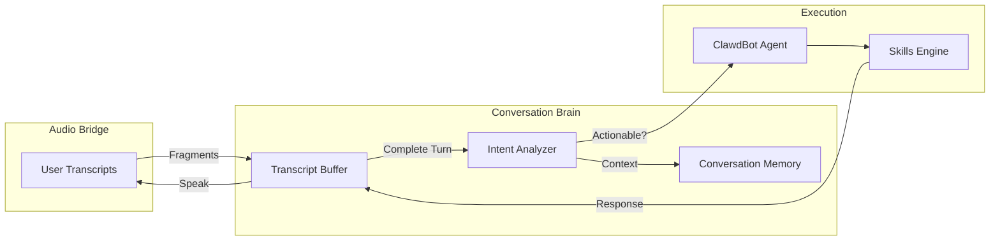
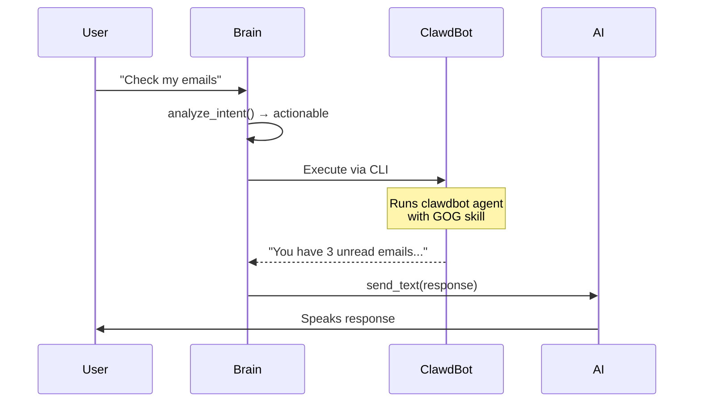
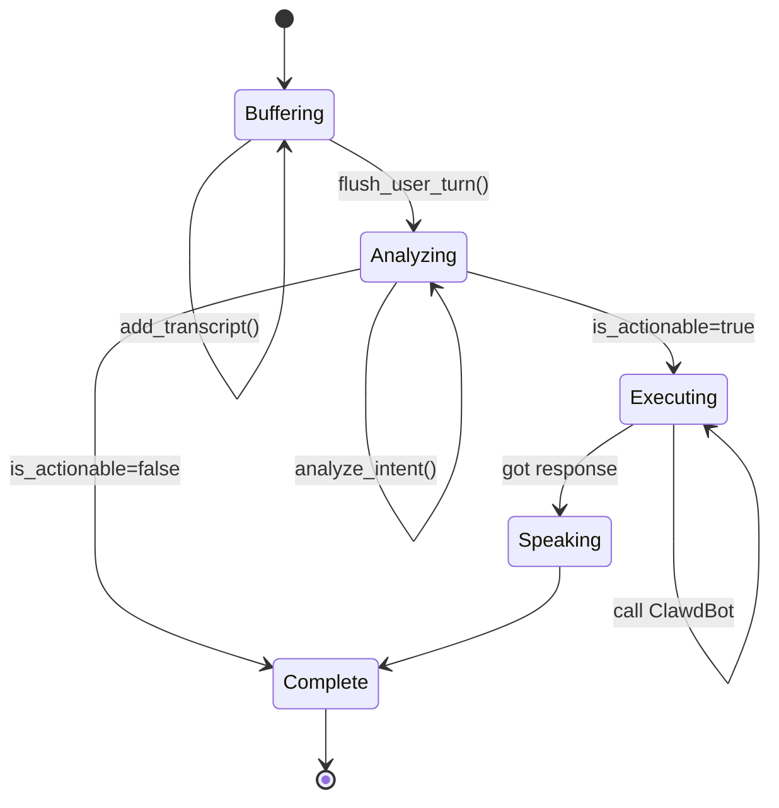

## Overview

The **ConversationBrain** is Agentic AI's intelligence layer that bridges natural conversation with executable actions. It analyzes user speech in real-time to determine intent, distinguish commands from casual chat, and route actionable requests to ClawdBot for execution.

<Info>
Location: `src/agenticai/core/conversation_brain.py:76`
</Info>

## Architecture



## Core Concepts

### Conversation Memory

The brain maintains context across the entire call using `ConversationMemory` (`conversation_brain.py:30`):

```python
@dataclass
class ConversationMemory:
    call_id: str
    turns: list[ConversationTurn]           # All conversation turns
    context: dict                            # Persistent context
    extracted_info: dict                     # Extracted entities
```

Each turn captures:
- **Speaker**: "user" or "assistant"
- **Text**: What was said
- **Timestamp**: When it was said
- **Intent**: Classified intent (if user turn)
- **Command**: Parsed command details (if actionable)

<Tip>
Conversation memory allows the brain to maintain context for follow-up questions like "Do that again" or "What was the first one?"
</Tip>

### Transcript Buffering

Realtime APIs send transcripts incrementally (word-by-word or phrase-by-phrase). The brain buffers these fragments:

```python
# conversation_brain.py:213
def add_user_transcript(self, text: str):
    """Add user transcript fragment."""
    if text:
        self._user_buffer.append(text)
```

Fragments are flushed when:
- User stops speaking (turn complete event)
- Silence detected (when using Whisper STT)

<Note>
Fragments are concatenated **directly without added spaces** - the STT engine includes proper spacing.
</Note>

## Intent Analysis

The brain uses a **two-stage approach** to classify intent efficiently:

### Stage 1: Quick Heuristics

Fast pattern matching to skip LLM calls for obvious cases (`conversation_brain.py:322`):

```python
# Skip greetings and simple phrases
non_actionable_phrases = [
    "hi", "hello", "hey", "thanks", "okay", "yes", "no"
]

# Quick detection of action keywords
action_keywords = [
    "open", "play", "search", "send", "check", 
    "email", "message", "youtube", "spotify"
]
```

**Benefits:**
- Saves 300-800ms per turn
- Reduces API costs
- Improves responsiveness

### Stage 2: LLM Analysis

For ambiguous cases, uses Gemini Flash for fast classification (`conversation_brain.py:352`):

```python
prompt = f"""You are a simple intent classifier. 
Determine if the user wants you to DO something or just chatting.

Recent conversation:
{context}

User said: "{user_text}"

Is this a request to DO something?
Answer with just ONE word: YES or NO"""
```

<Info>
The prompt is intentionally **liberal** - defaults to "actionable" when uncertain. ClawdBot's LLM handles ambiguity on the execution side.
</Info>

**Returns:**
- **Intent**: `"action"` or `"conversation"`
- **Command dict**: `{"original_request": "..."}`
- **is_actionable**: `True` or `False`

## Command Routing

When a command is detected as actionable, the brain routes it to ClawdBot:



### ClawdBot Execution

Commands are sent to ClawdBot via subprocess (`conversation_brain.py:140`):

```python
cmd = [
    "clawdbot", "agent",
    "--session-id", "agent:main:main",
    "--message", processed_command,
    "--timeout", "90",
]

process = await asyncio.create_subprocess_exec(
    *cmd,
    stdout=asyncio.subprocess.PIPE,
    stderr=asyncio.subprocess.PIPE,
    env={...},
)
```

<Warning>
**Timeout handling**: Commands timeout after 90 seconds to prevent hanging the call. User is notified if still processing.
</Warning>

### Response Handling

ClawdBot's response is spoken back to the user (`conversation_brain.py:276`):

```python
if response and self._on_clawdbot_response:
    # Feed response back to AI to speak it
    await self._on_clawdbot_response(response)
```

The `on_clawdbot_response` callback sends the result to the Realtime API with a relay prompt:

```python
# From audio_bridge.py:314
prompt = f"""The system has retrieved the following information.
Please relay this information naturally and concisely.

Information to relay:
{response}"""
```

## Callback Architecture

The brain uses callbacks to decouple from audio handling:

```python
self._brain.set_callbacks(
    on_command=handle_command,              # Optional
    on_clawdbot_response=speak_response,    # Required
)
```

**Callbacks:**
1. `on_command` - Notified when command detected (for logging/telemetry)
2. `on_clawdbot_response` - Receives ClawdBot's response to speak

## Turn Lifecycle

### User Turn



**Code Flow:**

```python
# 1. Buffer fragments
add_user_transcript("Check")  # Fragment 1
add_user_transcript(" my")    # Fragment 2
add_user_transcript(" emails") # Fragment 3

# 2. Flush complete turn
await flush_user_turn()
  ↓
# 3. Analyze intent
intent, command, is_actionable = await _analyze_intent(full_text)
  ↓
# 4. Route if actionable
if is_actionable:
    response = await _send_to_clawdbot_async(full_text)
    await self._on_clawdbot_response(response)
```

### Assistant Turn

Assistant turns are simpler - just buffered and flushed:

```python
# Buffer AI's speech fragments
add_assistant_transcript("I'll")
add_assistant_transcript(" check")
add_assistant_transcript(" your emails now.")

# Flush when AI finishes speaking
await flush_assistant_turn()
```

<Note>
Assistant transcripts are **not** sent to Telegram. Only executable commands go to the ClawdBot agent.
</Note>

## Configuration

Brain initialization (`conversation_brain.py:85`):

```python
ConversationBrain(
    api_key=gemini_api_key,                    # For intent analysis
    model="gemini-3-flash-preview",            # Fast classification
    telegram_chat_id=chat_id,                  # For ClawdBot agent
    call_id=call_id,                           # Session tracking
)
```

**Key Parameters:**
- `api_key` - Gemini API key for intent LLM
- `model` - Fast model for classification (Flash recommended)
- `telegram_chat_id` - Used to identify ClawdBot agent session
- `call_id` - Unique identifier for conversation memory

## Performance Optimization

### Buffering Strategy

The brain buffers transcript fragments to avoid:
- Analyzing incomplete thoughts
- Multiple LLM calls per sentence
- Premature command execution

**Buffer flush triggers:**
1. Turn complete event from Realtime API
2. Silence detection (when using Whisper)
3. Manual flush (for testing)

### Intent Analysis Caching

Quick heuristics cache common patterns:

```python
# Instant classification (no LLM call)
if text_lower in non_actionable_phrases:
    return "conversation", None, False

if any(kw in text_lower for kw in action_keywords):
    return "action", {...}, True
```

**Performance Impact:**
- Heuristic match: ~1ms
- LLM analysis: ~300-800ms
- Savings: 60-80% of turns use heuristics

## Error Handling

### Intent Analysis Failures

```python
# conversation_brain.py:385
except Exception as e:
    logger.error("Error analyzing intent", error=str(e))
    # Default to actionable to avoid missing commands
    return "action", {"original_request": user_text}, True
```

<Warning>
**Fail-safe behavior**: On error, defaults to treating requests as actionable. This ensures important commands aren't ignored, at the cost of potentially over-routing casual conversation.
</Warning>

### ClawdBot Execution Failures

```python
except asyncio.TimeoutError:
    return "I'm still working on that. It's taking longer than expected."
except Exception as e:
    return f"Sorry, I encountered an error: {str(e)}"
```

Errors are spoken to the user naturally, keeping the conversation flowing.

## Debug Logging

The brain includes extensive debug output:

```python
print(f"=== BRAIN BUFFER: {len(self._user_buffer)} fragments ===")
print(f"=== BRAIN FLUSH: {num_fragments} fragments → \"{full_text}\" ===")
print(f"=== BRAIN: Actionable={is_actionable} (LLM said: {answer}) ===")
print(f"=== BRAIN: Sending to ClawdBot: \"{full_text}\" ===")
```

<Tip>
These logs are invaluable for debugging intent classification and understanding conversation flow during development.
</Tip>

## Best Practices

### System Instructions

Craft system instructions that emphasize the agent's capabilities:

```python
agent_system_instruction = """You are Alchemy, an AI agent with REAL capabilities:
- You CAN check and send emails
- You CAN send messages to Telegram, WhatsApp, Discord
- You CAN search the web

When asked to do something, SAY "I'll do that now" and describe what you're doing."""
```

This primes the LLM to acknowledge commands confidently.

### Intent Prompt Design

Keep the intent prompt **simple and decisive**:

```python
# ✅ Good - clear binary choice
"Is this a request to DO something? Answer YES or NO"

# ❌ Bad - allows uncertainty
"What is the user's intent? Explain your reasoning."
```

### Context Window

Limit context to recent turns to stay focused:

```python
def get_recent_context(self, max_turns: int = 10) -> str:
    recent = self.turns[-max_turns:]
    # ...
```

## Example Scenarios

### Scenario 1: Email Check

```
User: "Check my emails"
  ↓
Brain: Quick keyword match "check" + "emails"
  ↓
Classification: actionable (heuristic)
  ↓
ClawdBot: Execute GOG skill
  ↓
Response: "You have 3 unread emails: 1 from John..."
  ↓
AI speaks response to user
```

### Scenario 2: Casual Chat

```
User: "How are you?"
  ↓
Brain: Quick match on common phrase
  ↓
Classification: conversation (heuristic)
  ↓
No ClawdBot call
  ↓
AI responds naturally from conversation
```

### Scenario 3: Ambiguous Request

```
User: "What's the weather like?"
  ↓
Brain: No heuristic match
  ↓
LLM Analysis: "DO something" (get weather) → YES
  ↓
Classification: actionable
  ↓
ClawdBot: Execute search skill
  ↓
Response: "It's 72°F and sunny in San Francisco"
```

## Related Components

<CardGroup cols={2}>
  <Card title="Architecture" icon="sitemap" href="/concepts/architecture">
    See how the brain fits into the overall system
  </Card>
  
  <Card title="ClawdBot Integration" icon="robot" href="/concepts/clawdbot-integration">
    Learn how commands are executed via OpenClaw Gateway
  </Card>
  
  <Card title="Audio Bridge" icon="waveform" href="/concepts/audio-pipeline">
    Understand how transcripts reach the brain
  </Card>
</CardGroup>