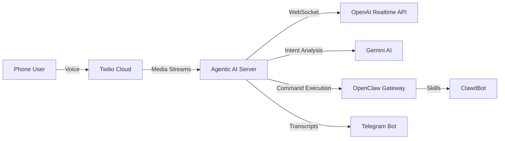

## Overview

Agentic AI is a CLI tool that enables AI-powered phone call agents with natural conversation capabilities. It combines **OpenAI Realtime API** for accurate voice transcription and generation, **Twilio** for phone connectivity, and **ClawdBot** integration via OpenClaw Gateway for executing commands during calls.

## What Can Agentic AI Do?

Agentic AI enables you to:

<CardGroup cols={2}>
  <Card
    title="Make AI Phone Calls"
    icon="phone"
    href="/quickstart"
  >
    Create AI agents that can make and receive phone calls with natural voice conversation powered by OpenAI Realtime API.
  </Card>
  <Card
    title="Execute Commands"
    icon="bolt"
    href="/features/clawdbot-integration"
  >
    Let your AI agent execute real-world commands via ClawdBot integration - play music, send messages, check emails, and more.
  </Card>
  <Card
    title="Accurate Transcription"
    icon="microphone"
    href="/features/voice-transcription"
  >
    Built-in Whisper STT from OpenAI Realtime API ensures proper nouns and names are transcribed correctly.
  </Card>
  <Card
    title="Background Service"
    icon="server"
    href="/deployment/service"
  >
    Run as a background daemon with auto-restart on crash, perfect for production deployments.
  </Card>
</CardGroup>

## Key Features

<AccordionGroup>
  <Accordion title="Real-time Voice Conversations" icon="comments">
    Powered by OpenAI Realtime API with `gpt-4o-realtime-preview-2024-12-17` model, enabling natural two-way conversations with ultra-low latency. Choose from 6 different voice options including alloy, echo, fable, onyx, nova, and shimmer.
  </Accordion>

  <Accordion title="Incoming & Outgoing Calls" icon="phone-volume">
    Make outbound calls to any phone number using the CLI, or configure your Twilio number to have the AI answer incoming calls automatically. Perfect for appointment reminders, customer service, or interactive voice agents.
  </Accordion>

  <Accordion title="Intent Understanding & Routing" icon="brain">
    Built-in conversation brain analyzes user intent using Gemini AI to determine if the caller wants to execute an action. Actionable commands are automatically routed to ClawdBot for execution.
  </Accordion>

  <Accordion title="ClawdBot Integration" icon="robot">
    Execute real-world commands during calls via OpenClaw Gateway:
    - Open YouTube and play videos
    - Play songs on Spotify  
    - Check and read emails
    - Send WhatsApp messages
    - Web search and more
    
    Results are spoken back to the caller in real-time.
  </Accordion>

  <Accordion title="Live Telegram Transcripts" icon="telegram">
    Optional Telegram bot integration sends live transcripts and command extractions to your Telegram chat, allowing you to monitor calls in real-time.
  </Accordion>

  <Accordion title="Tunnel Support" icon="network-wired">
    Built-in support for ngrok and Cloudflare tunnels to expose your local webhook server to Twilio. Includes CLI commands to start tunnels and manage webhook URLs.
  </Accordion>
</AccordionGroup>

## Architecture

Agentic AI uses a modular architecture that bridges multiple services:

**How it works:**

1. **Phone connectivity** - Twilio handles the telephony layer, connecting phone calls to your server via WebSocket media streams
2. **Audio bridge** - Agentic AI server routes audio between Twilio and OpenAI Realtime API with proper format conversion
3. **Voice processing** - OpenAI Realtime API transcribes incoming speech with Whisper and generates natural voice responses
4. **Intent analysis** - Gemini AI analyzes transcripts to identify actionable commands
5. **Command execution** - ClawdBot executes commands via OpenClaw Gateway (YouTube, Spotify, email, etc.)
6. **Response delivery** - ClawdBot results are spoken back to the caller through OpenAI's voice synthesis

## Use Cases

<CardGroup cols={2}>
  <Card title="Appointment Reminders" icon="calendar-check">
    Automatically call customers to confirm appointments, reschedule if needed, and execute calendar actions.
  </Card>
  <Card title="Customer Support" icon="headset">
    AI-powered support agent that can answer questions, look up information, and execute actions on behalf of customers.
  </Card>
  <Card title="Personal Voice Assistant" icon="user-robot">
    Call your personal AI assistant to play music, send messages, check emails, or control smart home devices.
  </Card>
  <Card title="Survey & Feedback Collection" icon="clipboard-question">
    Conduct automated phone surveys with natural conversation flow and intent understanding.
  </Card>
</CardGroup>

## Get Started

Ready to build your AI voice agent? Follow our quickstart guide:

<Card
  title="Quickstart Guide"
  icon="rocket"
  href="/quickstart"
>
  Make your first AI phone call in under 10 minutes
</Card>

## Requirements

Before you begin, you'll need:

- **Python 3.11 or higher**
- **Twilio account** with a phone number ([console.twilio.com](https://console.twilio.com/))
- **OpenAI API key** with Realtime API access ([platform.openai.com/api-keys](https://platform.openai.com/api-keys))
- **Gemini API key** for intent analysis ([aistudio.google.com/apikey](https://aistudio.google.com/apikey))
- **Telegram bot** (optional) for live transcripts ([@BotFather](https://t.me/BotFather))
- **OpenClaw Gateway** (optional) for ClawdBot integration ([github.com/openclaw/openclaw](https://github.com/openclaw/openclaw))

<Tip>
  The quickstart guide walks through obtaining all required API keys and credentials.
</Tip>
